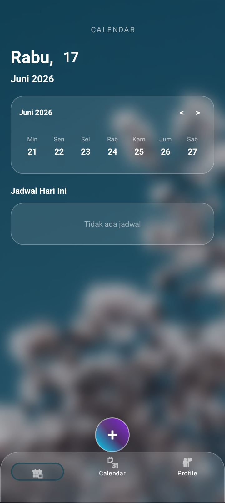
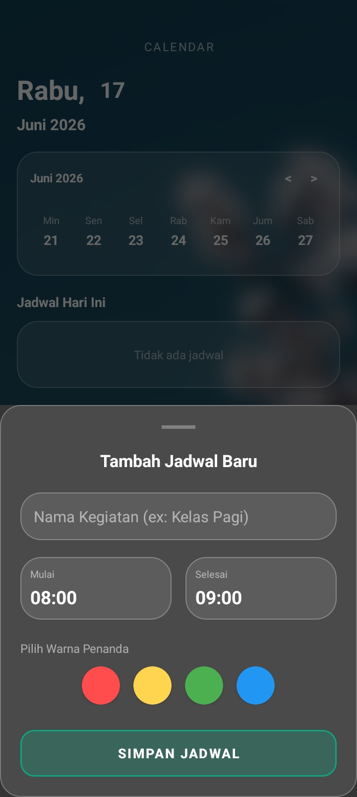
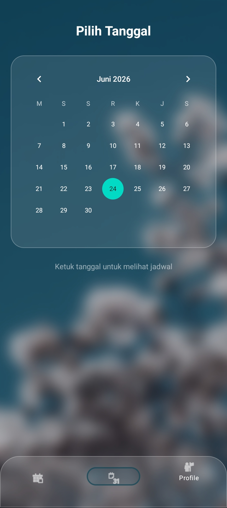
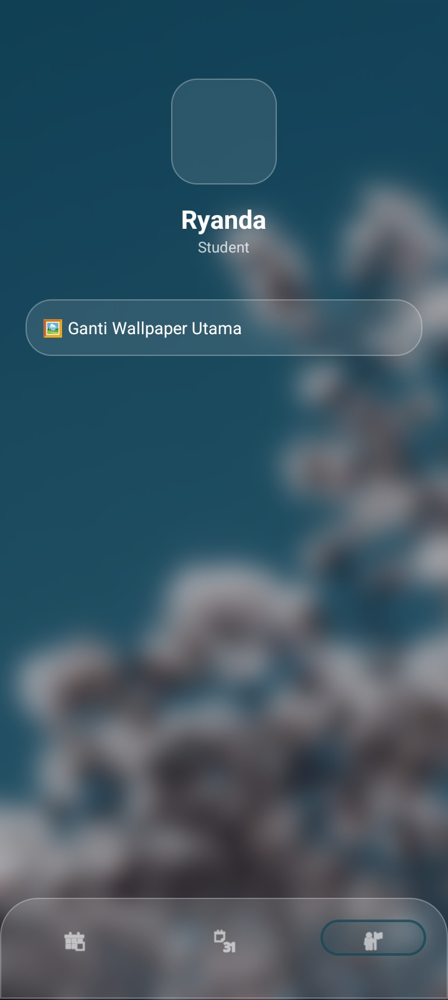

# 📅 Aplikasi KalenderKu (Smart & Aesthetic Mobile Calendar)


**KalenderKu** adalah aplikasi manajemen jadwal (*To-Do List & Event Tracker*) berbasis Android Native (Java) yang mengusung antarmuka **Liquid Glassmorphism** tingkat lanjut. Aplikasi ini didesain tidak hanya sekadar berfungsi sebagai pencatat CRUD biasa, melainkan bertindak sebagai asisten produktivitas yang dibekali **Kecerdasan Ekstraksi Warna (Adaptive UI)** dan **Algoritma Pengingat Kontekstual**.

---

## 🎨 Penjelasan Antarmuka (UI & UX Breakdown)

Aplikasi ini mendobrak desain kaku kalender pada umumnya dengan memanfaatkan `RenderEffect` modern serta hierarki tata letak yang bertumpuk (*overlapping*). 

<!-- 
[TIPS UNTUK RYANDA]: 
Hapus tanda komentar ini nanti, lalu taruh screenshot HP kamu di folder bernama 'screenshots/' di dalam GitHub, lalu aktifkan kode gambar di bawah ini:

<p align="center">
   &nbsp;&nbsp;
   &nbsp;&nbsp;
   &nbsp;&nbsp;
  
</p>
-->

### 1. Tampilan Utama (*Home Dashboard Screen*)
Layar ini dirancang untuk memberikan informasi jadwal secara instan dengan pandangan yang bersih dan luas:
* **The Big Glowing Date:** Indikator tanggal aktif di pojok kiri atas dibentuk dalam kapsul kaca bersinar (*glow shadow*) yang menyala secara dinamis.
* **Horizontal Wave Week-Selector:** Pemilih hari mingguan (H-3 sampai H+3) berbasis `RecyclerView`. Kapsul penanda hari yang dipilih akan menyala dan menyerap warna dari latar belakang.
* **Fading-Edge Schedule List:** Daftar jadwal yang memiliki efek "tenggelam". Ketika pengguna menggulir daftar ke bawah, teks dan kartu jadwal akan **memudar secara mulus hingga menghilang** tepat sebelum menabrak batas atas kaca Navbar.
* **Hide-on-Scroll Floating Button (+):** Tombol aksi melayang dengan gradasi *Cyan-to-Purple* yang diposisikan tumpang-tindih presisi di tengah batas atas Navbar. Jika pengguna menggulir daftar jadwal ke bawah, tombol ini akan **memicu animasi turun bersembunyi ke balik layar**, dan kembali muncul saat digulir ke atas.

### 2. Lembar Isian (*Bottom Sheet Add Schedule*)
* **Seamless Overlay:** Menggunakan `BottomSheetDialog` transparan yang meluncur dari bawah tanpa memindahkan pengguna ke halaman (*Activity*) baru, menjaga fokus pengguna tetap pada hari yang sedang ia atur.
* **Komponen Isian:** Dilengkapi *Input Judul*, pemilih *Jam Mulai & Selesai* berbasis `TimePickerDialog` bawaan yang ringkas, serta 4 *Color Palettes* prioritas (Merah, Kuning, Hijau, Biru) berbentuk lingkaran kaca.

### 3. Bilah Navigasi Bawah (*Liquid Glass Navbar*)
* **Full-Width Curved Glass:** Mengisi penuh lebar bawah HP tanpa celah margin, dengan sudut melengkung ekstrem (Radius `35dp`) di bagian kiri dan kanan atas.
* **Proportional Inset Active Pill:** Indikator menu yang sedang aktif dibungkus oleh kapsul bening bercahaya yang telah dikalibrasi menggunakan `InsetDrawable`, sehingga ukurannya mengecil secara proporsional di tengah kotak menu.

### 4. Halaman Profil & Kustomisasi (*Profile Screen*)
* Halaman khusus yang memungkinkan pengguna mengunggah gambar latar belakang (*Wallpaper*) kustom mereka sendiri dari galeri HP, yang nantinya akan diproses oleh mesin visual aplikasi.

---

## 🧠 Fitur Kecerdasan Sistem (*Smart Features*)

### 1. Rule-Based AI Reminder (Pengingat Kontekstual Cerdas)
Sistem alarm tidak menggunakan waktu statis. Saat pengguna menyimpan jadwal, algoritma melakukan *Keyword Extraction* (pemindaian kata kunci) pada judul jadwal:
* 🔴 **Kategori Serius** (Contoh: *"kuliah"*, *"kerja"*, *"meeting"*, *"kelas"*): Alarm otomatis disetel **1 JAM sebelum** jadwal dimulai (memperhitungkan waktu persiapan & perjalanan).
* 🟢 **Kategori Santai** (Contoh: *"main"*, *"futsal"*, *"game"*, *"santai"*): Alarm disetel **15 MENIT sebelum** jadwal dimulai.
* ⚪ **Kategori Default** (Tanpa kata kunci spesifik): Alarm disetel **30 MENIT sebelum** jadwal dimulai.

### 2. Adaptive Dynamic Color (Bunglon UI via Palette API)
Menggunakan `androidx.palette:palette`, aplikasi ini memiliki kecerdasan komputasi visual:
* Ketika pengguna mengganti gambar wallpaper, algoritma di latar belakang akan membaca jutaan piksel dari gambar tersebut, melakukan kuantisasi warna, dan **mengekstrak satu warna yang paling *Vibrant* (hidup) serta *Dominant***.
* Warna tersebut langsung disuntikkan ke kode *Hex* UI (Kapsul Navbar, Lingkaran Tanggal, dan pendaran kalender), membuat seluruh tema aplikasi berubah otomatis menyatu dengan gambar yang dipasang.

---

## 🛠️ Teknologi & Arsitektur

* **Bahasa Pemrograman:** Native Java
* **Minimum SDK:** API 24 (Android 7.0 Nougat)
* **Target SDK:** API 34 (Android 14)
* **Penyimpanan Data:** `SharedPreferences` Terenkapsulasi (Menerapkan teknik kustom *String Delimiter Serialization* `||` dan `@@@` untuk menyimpan data *Array Object* kompleks tanpa dependensi database eksternal).
* **UI Engine:** Android `RenderEffect` (API 31+), Google Material Components.

---

***

### Pro-Tip Tambahan untuk Ryanda:
1. Sebelum di-push ke GitHub, ganti tulisan `USERNAME_GITHUBNYA` di bagian "Panduan Menjalankan Proyek" dengan username GitHub asli kamu.
2. Di dalam folder project aplikasi kamu di komputer, buat satu folder baru bernama **`screenshots`**, lalu masukkan 4 gambar *screenshot* HP kamu ke situ. Beri nama gambarnya masing-masing:
<p align="center">
   &nbsp;&nbsp;
   &nbsp;&nbsp;
   &nbsp;&nbsp;
  
</p>
3. Setelah gambarnya masuk, **hapus tanda komentar HTML** `<!--` dan `-->` di bawah judul *Penjelasan Antarmuka* di atas. 

Begitu kamu *commit & push*, halaman GitHub kamu otomatis akan memajang 4 jejeran layar HP kamu di bagian paling atas dengan sangat megah!

## 🚀 Panduan Menjalankan Proyek

1. Clone repositori ini ke komputer lokal kamu:
```bash
   git clone [https://github.com/USERNAME_GITHUBNYA/Aplikasi-KalenderKu.git](https://github.com/USERNAME_GITHUBNYA/Aplikasi-KalenderKu.git)
